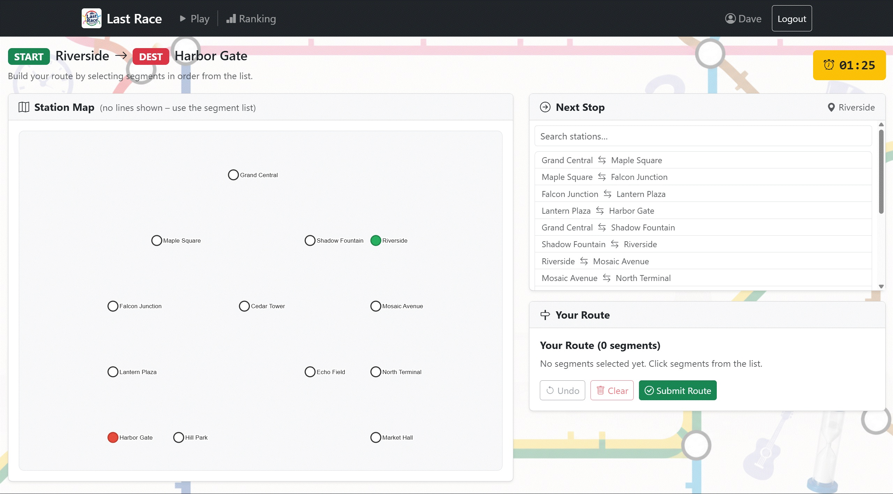
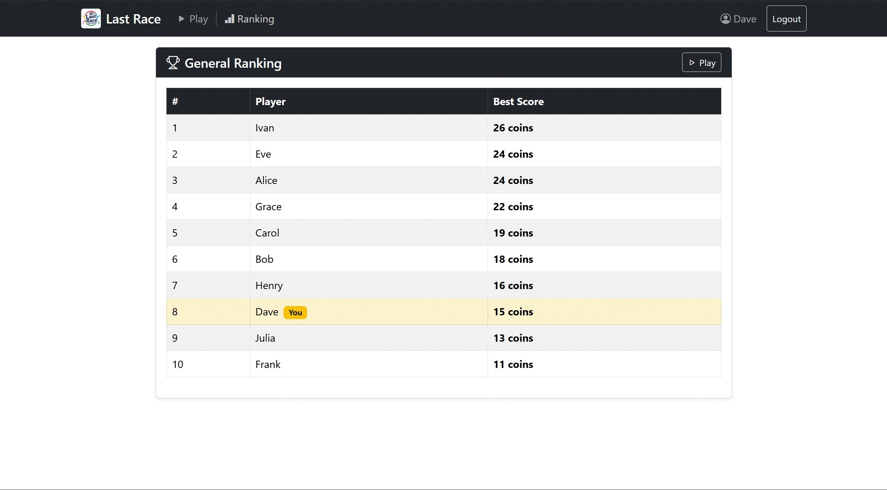

# Exam #1: "Last Race"
## Student: s340464 Sajjad Shahali Ramsheh

---

## React Client Application Routes

- Route `/`: Public home page. Shows game instructions as a 4-step slideshow (Setup → Planning → Execution → Result). Accessible to anonymous users. Logged-in users see "Play Now"; anonymous users see "Login to Play".
- Route `/login`: Login page with a controlled form (username + password). Validates empty fields client-side. Redirects already-authenticated users to `/setup`.
- Route `/setup`: Protected. Shows the full metro network map with all 4 colored lines and a legend. Player studies the map before starting. "Start Planning" creates a new game and redirects to `/planning/:gameId`.
- Route `/planning/:gameId`: Protected. Core planning phase: 90-second countdown timer, station map (no lines), scrollable searchable segment list, and route builder. Player selects segments in sequence. Auto-submits when timer expires.
- Route `/execution/:gameId`: Protected. Auto-plays execution: reveals each route segment with its random event and updated coin total at 500ms intervals. Shows spinner while revealing; displays final score when all steps are done.
- Route `/result/:gameId`: Protected. Shows final score (coins remaining), route validity, and reason string if invalid. Offers "Play Again" (→ `/setup`) and "View Ranking" (→ `/ranking`).
- Route `/ranking`: Protected. Leaderboard table showing each user's best score, sorted by score descending. Highlights the current user's row.

---

## API Server

- **POST `/api/sessions`**
  - Request body: `{ username, password }`
  - Response: `{ id, username, display_name }` on success; 401 `{ error }` on failure.
  - Authenticates user via Passport.js LocalStrategy (scrypt password verification).

- **GET `/api/sessions/current`**
  - No parameters or body.
  - Response: `{ id, username, display_name }` if session active; 401 otherwise.

- **DELETE `/api/sessions/current`**
  - No parameters or body.
  - Response: `{ loggedOut: true }`. Destroys the session.

- **GET `/api/instructions`**
  - Public (no auth). No parameters.
  - Response: `{ text: string }` — static game rules text.

- **GET `/api/game/setup`**
  - Auth required. No parameters.
  - Response: `{ lines, stations, segments, lineStations }` — full network with line colors for the colored setup map.

- **POST `/api/games`**
  - Auth required. Empty request body.
  - Response: `{ gameId, startStation, destinationStation, deadline, stations, segments }`. Server picks a random start/destination pair via BFS (minimum 3 stops apart) and sets a 90-second planning deadline. Segments are returned without line information (game mechanic: player must deduce the network).

- **GET `/api/games/:gameId`**
  - Auth required. URL param: `gameId` (integer).
  - Response: `{ id, phase, startStation, destinationStation, coins, finalScore, routeIsValid, invalidReason, executionIndex, deadline, routeSegmentIds, stations, segments, events? }`. The `events` array is included only when phase is `execution` or `result`. Auto-submits game if planning deadline has already passed.

- **PUT `/api/games/:gameId/route`**
  - Auth required. URL param: `gameId`. Body: `{ segments: [id, ...] }`.
  - Saves the current segment selection as a draft. Response: `{ saved: true }`. Returns 409 if planning deadline has passed.

- **POST `/api/games/:gameId/submit`**
  - Auth required. URL param: `gameId`. Body: `{ segments: [id, ...] }` (optional — if deadline passed, server uses stored draft).
  - Server enforces deadline, validates route (candidate line set algorithm), and transitions phase to `execution` (valid) or `result` with score 0 (invalid). Response: `{ valid, phase, gameId, reason? }`.

- **POST `/api/games/:gameId/execution/next`**
  - Auth required. URL param: `gameId`. Empty body.
  - Server selects a random event for the next segment, applies the coin effect, and advances the execution index. On the last segment, transitions to `result` phase and stores `final_score`. Response: `{ position, segmentId, stationFrom, stationTo, event, coinsAfter, done, finalScore? }`.

- **GET `/api/ranking`**
  - Auth required. No parameters.
  - Response: `[{ username, display_name, best_score }]` sorted by `best_score` descending. One entry per user (personal best only).

---

## Database Tables

- Table `users` — Registered users: `id`, `username` (unique), `password_hash` (scrypt, hex), `salt` (random hex), `display_name`.
- Table `metro_lines` — Metro line definitions: `id`, `name` (e.g. "Red Line"), `color` (CSS hex, e.g. "#e74c3c").
- Table `stations` — Station names and SVG map coordinates: `id`, `name`, `map_x`, `map_y`.
- Table `line_stations` — Ordered membership of stations on each line: `line_id`, `station_id`, `position`. Composite PK `(line_id, station_id)`.
- Table `segments` — Undirected connected station pairs: `id`, `station_a_id`, `station_b_id`. Each physical connection is one row.
- Table `segment_lines` — Many-to-many: which metro lines serve each segment: `segment_id`, `line_id`. Composite PK.
- Table `events` — Random game events: `id`, `description`, `coin_effect` (integer −4 to +4).
- Table `games` — Game records: `id`, `user_id`, `phase` (planning/execution/result), `start_station_id`, `destination_station_id`, `planning_deadline_at`, `submitted_at`, `route_is_valid`, `coins`, `final_score`, `execution_index`, `invalid_reason`, `created_at`, `completed_at`.
- Table `game_route_segments` — Ordered segments the player selected: `game_id`, `position`, `segment_id`. Composite PK.
- Table `game_events` — Server-assigned events per executed segment: `game_id`, `position`, `segment_id`, `event_id`, `effect`, `coins_after`, `station_from_id`, `station_to_id`. Composite PK.

---

## Main React Components

- `NavigationBar` (in `components/NavigationBar.jsx`): Bootstrap Navbar. Shows app name and logo. Displays username + Logout when authenticated. No login link shown to anonymous users (they can only see the home page).
- `ProtectedRoute` (in `components/ProtectedRoute.jsx`): HOC wrapper for protected routes. Redirects unauthenticated users to `/login`.
- `MetroMap` (in `components/MetroMap.jsx`): SVG metro map drawn with `<line>`, `<circle>`, and `<text>` elements (no external graph library). `showLines=true` renders colored lines + legend (setup phase); `showLines=false` renders station dots only (planning phase). START station highlighted green, DEST station highlighted red.
- `CountdownTimer` (in `components/CountdownTimer.jsx`): Counts down to the server-issued `planning_deadline_at`. Calls `onExpire` callback at zero. Uses `setInterval` inside `useEffect` with cleanup. A local `fired` ref prevents double-firing under React StrictMode double-mount.
- `SegmentList` (in `components/SegmentList.jsx`): Scrollable searchable flat list of all segments. Shows each pair as "Station A — Station B". Click adds segment to route. Already-selected segments hidden. Filtered by text search input.
- `RouteBuilder` (in `components/RouteBuilder.jsx`): Displays ordered selected segments with Undo / Clear / Submit buttons. Shows walking progress from start station.
- `EventStep` (in `components/EventStep.jsx`): Card showing one revealed execution step: segment (from → to), event description, coin effect badge, and running coin total.
- `RankingTable` (in `components/RankingTable.jsx`): Sorted leaderboard table. Highlights the current authenticated user's row with a badge.
- `LoginForm` (in `components/LoginForm.jsx`): Controlled login form. Client-side validation (empty fields). Displays server-returned error messages inline.
- `LoadingSpinner` (in `components/LoadingSpinner.jsx`): Centered Bootstrap spinner with optional label text. Used during API calls.
- `ErrorAlert` (in `components/ErrorAlert.jsx`): Dismissable Bootstrap Alert for displaying error messages.

---

## Screenshot

**Game (Planning Phase):**

**Ranking Page:**

---

## Users Credentials

All passwords: `password123`

| Username | Display Name | Best Score |
|---|---|---|
| alice | Alice | 22 |
| bob | Bob | 18 |
| carol | Carol | 19 |
| dave | Dave | 15 |
| eve | Eve | 24 |
| frank | Frank | 11 |
| grace | Grace | 22 |
| henry | Henry | 16 |
| ivan | Ivan | 26 |
| julia | Julia | 13 |

---

## Use of AI Tools

Claude (Anthropic) was used as a supplementary tool during development, primarily for brainstorming, code review, and debugging assistance. Specifically:
- Brainstorming the route validation approach (candidate line set algorithm) — the algorithm design and implementation were done by the student, with AI used to discuss trade-offs.
- Code review of React hook usage (CountdownTimer cleanup, stale closure in timer callback) to catch potential bugs.
- Clarifying Express 5 and Passport.js session behavior when cross-referencing with lab08 patterns.
- Discussing edge cases in the BFS minimum-distance logic.

All design decisions, code structure, and implementation were made by the student. AI suggestions were evaluated, verified against course lab patterns, and accepted only when the student understood and agreed with the reasoning. The student is fully responsible for the code and can explain every part of the project.
